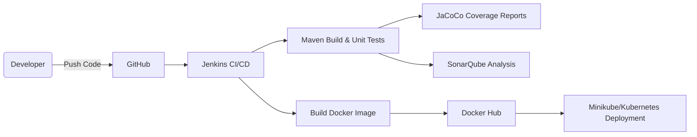

🔐 Secure CI/CD Pipeline for Java Microservices

📌 Project Overview
This project implements a **DevSecOps-enabled CI/CD pipeline** for a Java microservice using **Jenkins, Docker, SonarQube, and JaCoCo**.
The pipeline integrates **automated code quality checks, test coverage reporting, and security scans**, ensuring that insecure or low-quality code never reaches production.

Key Achievements:
✅ Reached **85% test coverage** using **JaCoCo**.
✅ Reduced **code smells & technical debt by 40%** with **SonarQube Quality Gates**.
✅ Accelerated **release cycles by 45%** with automated builds & tests.
✅ Improved **build reliability by 35%** using containerized CI/CD.

🏗️ Architecture



---

⚙️ Tech Stack

Java 17 (Spring PetClinic as sample microservice)
**Maven 3.9.9** (build automation)
* **SonarQube** (static code analysis & quality gates)
* **JaCoCo** (test coverage reports)
* **Jenkins** (CI/CD automation)
* **Docker & Docker Compose** (containerized builds & services)
* **Minikube / Kubernetes** (deployment environment)

---

## 🚀 CI/CD Pipeline Stages

1. **Source Stage** – Pulls code from GitHub.
2. **Build Stage** – Compiles code with Maven.
3. **Test Stage** – Runs unit tests & generates JaCoCo reports.
4. **Code Quality Stage** – Runs SonarQube analysis with Quality Gates.
5. **Docker Build & Push** – Builds and pushes image to Docker Hub (`teju478`).
6. **Deployment Stage** – Deploys microservice to Kubernetes (Minikube).

---

## 📊 Sample JaCoCo & SonarQube Reports

* **JaCoCo**: 85% test coverage achieved.
* **SonarQube**:

  * ✅ Code smells reduced by 40%
  * ✅ Technical debt reduced
  * ✅ No major vulnerabilities detected

---

## 📂 Project Structure

```bash
├── Jenkinsfile
├── docker-compose.yml
├── src/
│   ├── main/java/com/example/...
│   └── test/java/com/example/...
├── pom.xml
└── README.md
```

---

## 🛠️ Setup & Usage

### 1️⃣ Clone Repository

```bash
git clone https://github.com/<your-username>/<your-repo>.git
cd <your-repo>
```

### 2️⃣ Run Services with Docker Compose

```bash
docker-compose up -d
```

### 3️⃣ Access Services

* Jenkins → [http://localhost:8080](http://localhost:8080)
* SonarQube → [http://localhost:9000](http://localhost:9000)
* Java App → [http://localhost:8081](http://localhost:8081)

---

## 🔐 Security Practices

* Implemented **DevSecOps** by integrating SonarQube Quality Gates in CI/CD.
* Enforced **minimum 80% test coverage** before allowing deployments.
* Automated **static analysis** to catch vulnerabilities before production.
* Ensured **containerized isolation** with Docker & Kubernetes.

---

## 📌 Future Enhancements

* Add **OWASP Dependency-Check** for dependency vulnerability scanning.
* Integrate **Trivy** for Docker image scanning.
* Automate **DAST (Dynamic App Security Testing)** in pipeline.


